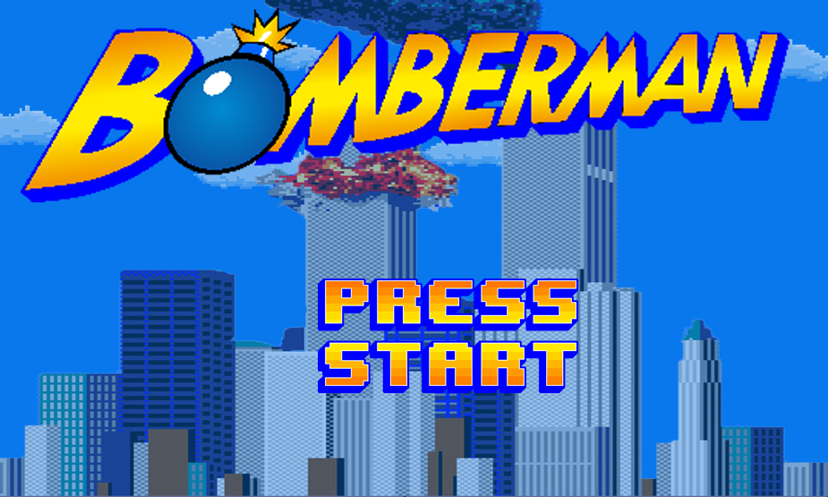

# Bomberman




Recreación del famoso videojuego bomberman en python. Con features como:

- Deteccion de esquinas (para un movimiento mas fluido)

- Generacion aleatoria de enemigos y obstaculos

- Power-Ups

- Sprites animados

- Deteccion de colisiones

- Enemigos con deteccion de posibles rutas 

Los controles son las flechas de dirección para moverse y la barra espaciadora para poner las bombas

## Requisitos del sistema

- Python 3.10.12
- pip (gestor de paquetes de Python)

## Configuración

### Clonar el repositorio

Para obtener una copia del repositorio, puedes clonarlo utilizando Git:

```
git clone git@github.com:dTaba/Bomberman.git
cd Bomberman
```
### Configurar el entorno virtual (opcional pero recomendado)

Se recomienda utilizar un entorno virtual para evitar conflictos con otras dependencias. Puedes crear uno utilizando venv:


# Linux/macOS

```
python3 -m venv .venv
source venv/bin/activate
```


# Windows

```
python -m venv .venv
venv\Scripts\activate
```

### Instalar dependencias

Una vez configurado el entorno virtual, hay que instalar las dependencias del proyecto utilizando pip y el archivo requirements.txt:

```
pip install -r requirements.txt
```


## Ejecutar el juego

Una vez completados los pasos anteriores, podes ejecutar el juego:

```
python3 ./src/init.py
```
